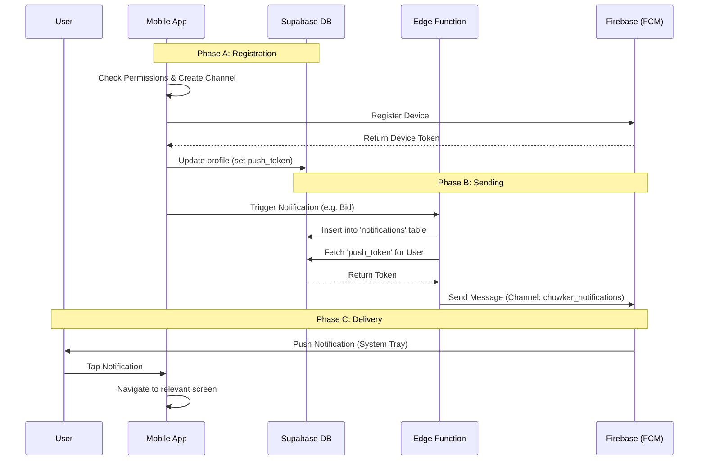

# Push Notification Architecture & Flow

This document explains how push notifications work in the Chowkar application, covering the entire lifecycle from user registration to notification delivery.

## 1. System Components
- **Client App (React/Capacitor)**: Handles permissions, registration, and receiving messages.
- **Supabase DB**: Stores user profiles and push tokens (`profiles` table) and notification history (`notifications` table).
- **Supabase Edge Function** (`send-push-notification`): The backend logic that acts as the secure dispatcher.
- **FCM (Firebase Cloud Messaging)**: Google's service that actually delivers the notification to the device.

## 2. The Flow

### Phase A: Registration (One-time setup)
When a user logs in on a mobile device:
1.  **Check Support**: App checks if it's running natively (Android/iOS).
2.  **Request Permissions**: `pushService.ts` requests notification permissions from the OS.
3.  **Create Channel**: App creates the Android Notification Channel `chowkar_notifications` (High Importance, Sound On).
4.  **Get Token**: `PushNotifications.register()` contacts FCM and retrieves a unique device token.
5.  **Save Token**: The app updates the `profiles` table in Supabase:
    ```sql
    UPDATE profiles SET push_token = 'DEVICE_TOKEN_123...' WHERE id = 'USER_ID';
    ```

### Phase B: Sending a Notification
When an event occurs (e.g., "Worker bids on job"):
1.  **Trigger**: The application logic (or database trigger) calls the Edge Function `send-push-notification`.
2.  **Lookup**: The function fetches the target user's `push_token` from the `profiles` table.
3.  **Persist**: The notification is saved to the `notifications` table for the in-app "bell" icon history.
4.  **Dispatch**: The function sends a secure request to FCM with the payload:
    ```json
    {
      "token": "DEVICE_TOKEN_123...",
      "notification": {
        "title": "New Bid Received",
        "body": "A worker has placed a bid...",
        "android": {
          "channelId": "chowkar_notifications"
        }
      }
    }
    ```
5.  **Delivery**: FCM pushes this message to the Android device.

### Phase C: Receiving

#### Scenario 1: App is in Background / Closed
- The Operating System receives the signal from FCM.
- Matches `channelId` (`chowkar_notifications`) to the config set in `pushService.ts`.
- **User sees:** A system tray notification with sound/vibration.
- **Action:** User taps the notification -> App opens -> `localNotificationActionPerformed` listener fires -> Navigates to the relevant screen.

#### Scenario 2: App is in Foreground
- **Realtime**: The `NotificationContext` is listening to Supabase Realtime changes on the `notifications` table.
- **User sees:** An in-app toast/alert (`showAlert`) immediately.
- **Note**: This bypasses the delay of FCM and keeps the UI responsive.

## 3. Diagram


